<h1 align="center">Hi 👋, I'm Arik Gershman!</h1>

A Computer Science Master's student at the University of Maryland, College Park (B.S. CS @ UMD '26). I'm passionate about leveraging data and technology to solve real-world problems, with a particular interest in Machine Learning as both a career path and a field of continuous learning.

This GitHub showcases my projects and analytical work, reflecting my journey in computer science and data science.

---

### 💡 My Focus & Interests
* Machine Learning: Deep learning, predictive modeling, statistical learning.
* Data Science: Data analysis, feature engineering, hypothesis testing, statistical inference.
* Other: Financial Technology, AI Ethics & Regulations, Economics.

---

### 🔗 Connect with Me

---

### 🛠️ Languages and Tools
<!-- Programming Languages -->

 
 

<!-- Data Science & ML Specific Tools -->

<!-- Frameworks & APIs -->

<!-- Development Tools & Platforms -->

<!-- Human Languages -->

---

